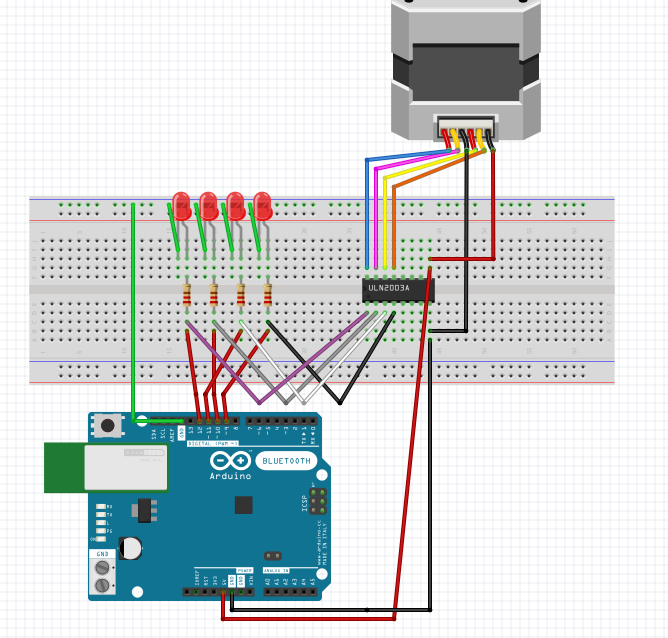

This is a step-by-step increase in complexity of the stepper motor Arduino program. 

The first four are nicely documented for learning. Sketches 4b-5b are what I used in my project. Its the same code,
but with different variable and math. Feel free to try and change the variables to what is in tutorials 1-4.

Andrew

Here is the Fritzing diagram for breadboarding the stepper motor example:

