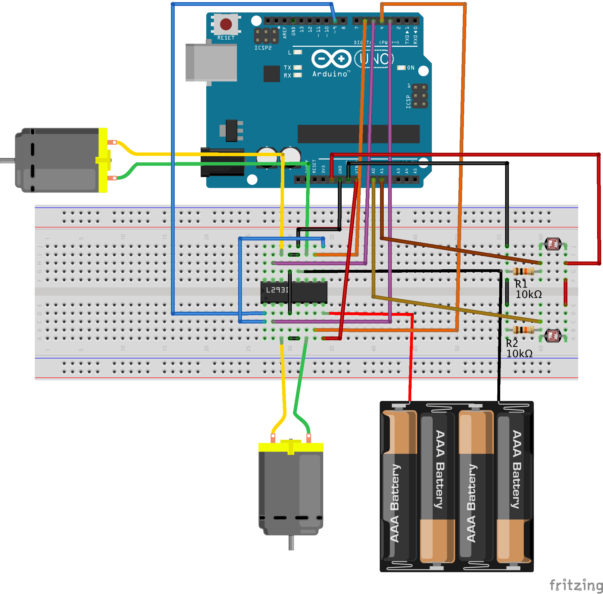

Herein are the design files for our robot chassis.  These are also available on the laser cutter laptop at Robot Garden at:
  * Libraries\Documents\My Documents\LPCMakerClass\Robot1
  
Please see the [Laser Cutter Class Manual](https://drive.google.com/file/d/0B0z8iTjN78OjWFJiWnEyOEs5bFk/edit?usp=sharing) and the [SBU page](http://www.robotgarden.org/workshop/safety-and-basic-use/) robot garden webpages for more information.

Robot1c differs from Robot1b in that it has parts for the nose roller ball mount for the tricycle wheel pattern.  Robot1b differed from Robot1a in that it extended the base to allow for more components to fit.

FreeCAD master file of the cut-out plans:
   * Robot1c.FCStd

An export from FreeCAD of the cut-out plans in "Flattened SVG" format:
   * Robot1c_flattened.svg

(If available) The Microsoft format (printed by Inkscape) of the Flattened SVG format.  This is what you open in the Full Spectrum laser cutter software:
   * Robot1c_flattened.xps

The files for just the nose ball trike assembly are:
 * Robot1cTrikeAssembly.FCStd
 * Robot1cTrikeAssembly_flattened.svg

Also we have the Fritzing files for wiring this robot.  These include:
 * Robot1_H-Bridge_Wiring.fzz  - the Fritzing file for the basic wiring of the H-bridge
 * Robot1_H-Bridge_Wiring.png  - PNG graphic of above Fritzing diagram
 * Robot1_H-Bridge_PhotoResistorWiring.fzz  - the H-bridge wiring contained in the file above plus the photoresistor circuits
 * Robot1_H-Bridge_PhotoResistorWiring.png  - PNG graphic of above Fritzing diagram

